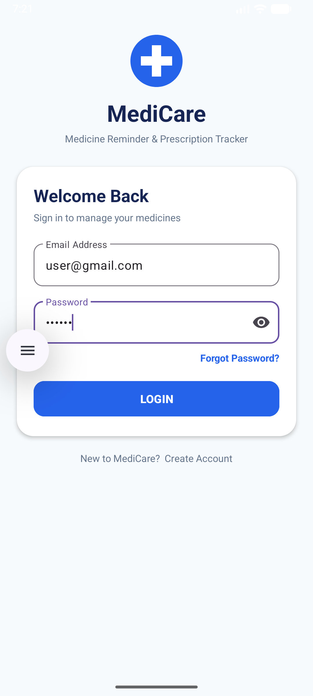
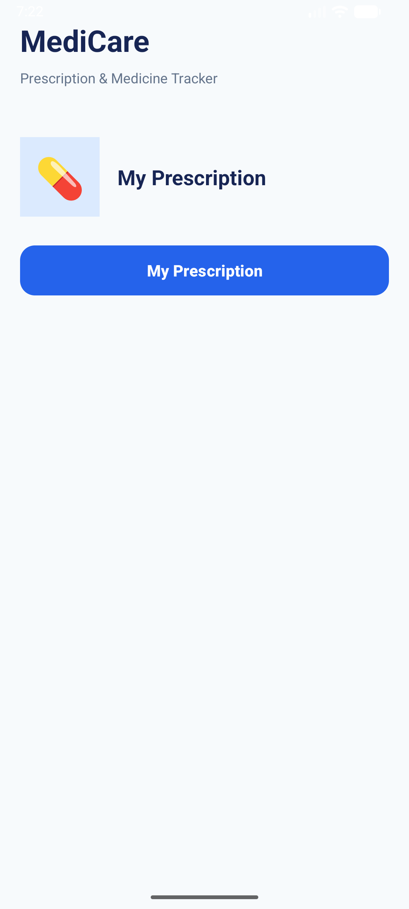
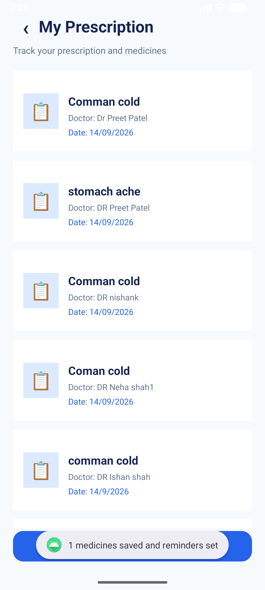
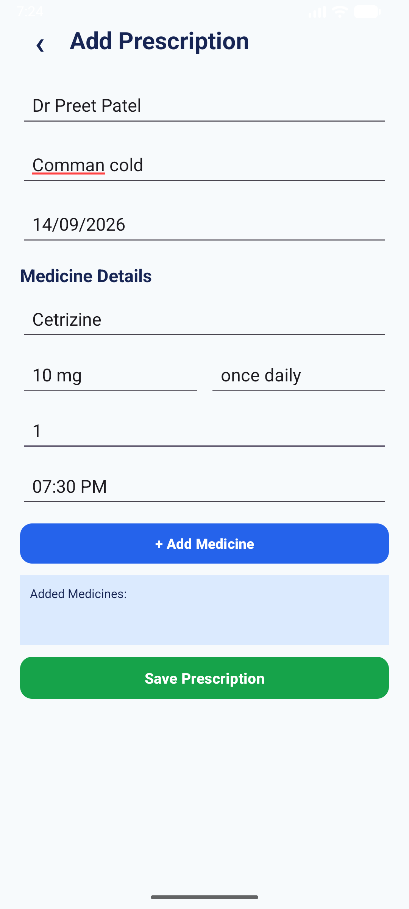
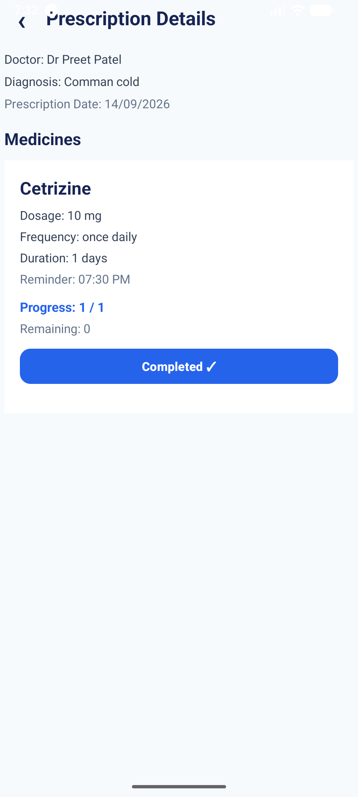
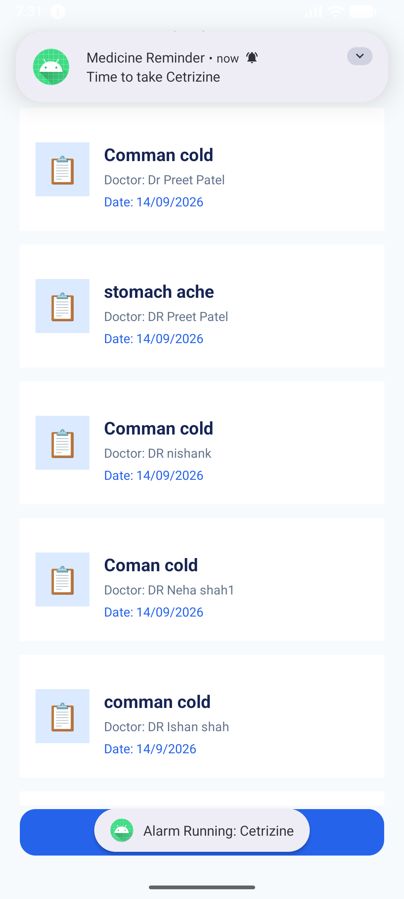

# 💊 MediCare – Medicine Reminder & Prescription Tracker

## 📱 Project Overview

**MediCare – Medicine Reminder & Prescription Tracker** is an Android application developed using **Kotlin and XML in Android Studio**.

The application is designed to help users manage their prescriptions and medicines in one place. Users can add prescription details, add multiple medicines, set reminder times, receive medicine notifications, and track the number of doses taken.

The main purpose of the application is to make medicine management simple, organized, and easy to track.

---

## 🎯 Objectives

The main objectives of the MediCare application are:

- To develop a simple and user-friendly medicine reminder application.
- To digitally store prescription information.
- To allow users to add multiple medicines under one prescription.
- To store medicine name, dosage, frequency, duration, and reminder time.
- To provide medicine reminders using Android notifications.
- To help users remember their scheduled medicine doses.
- To track the number of doses taken.
- To display remaining doses and completed doses.
- To store prescription and medicine information using SQLite.
- To demonstrate important Android development concepts.

---

## ✨ Key Features

- 🔐 Simple Login Page
- 💊 My Prescription Management
- ➕ Add Multiple Medicines
- 👨‍⚕️ Doctor and Diagnosis Details
- 📅 Prescription Date
- 💉 Medicine Name and Dosage
- 🔄 Medicine Frequency
- ⏳ Medicine Duration
- ⏰ Medicine Reminder Time
- 🔔 Notification Reminder
- 📄 Prescription Details
- 📊 Medicine Progress Tracking
- ✅ Mark Medicine as Taken
- 🗄️ SQLite Local Database
- 📱 Simple and User-Friendly Interface

---

## 🛠️ Technologies Used

| Technology | Purpose |
|---|---|
| **Android Studio** | Application development |
| **Kotlin** | Programming language |
| **XML** | User interface design |
| **ConstraintLayout** | UI layout design |
| **SQLite** | Local database storage |
| **RecyclerView** | Display prescriptions and medicines |
| **AlarmManager** | Schedule medicine reminders |
| **BroadcastReceiver** | Receive scheduled alarms |
| **Notification** | Notify users about medicine time |

---

# 📸 Application Screenshots

## 1. 🔐 Login Page

The Login Page provides the entry point to the MediCare application.

Users can enter their login information and access the application.

---

## 2. 💊 My Prescription

The My Prescription page displays the prescriptions saved by the user.

Users can:

- View saved prescriptions
- Open prescription details
- Add a new prescription

---

## 3. 📋 Listed Prescription

After a prescription is saved, it appears in the prescription list.

Each listed prescription displays important information such as:

- Disease / Diagnosis
- Doctor Name
- Prescription Date

Users can select a prescription to view its complete details.

---

## 4. 📝 Set Prescription Form

The Set Prescription Form allows users to enter prescription and medicine information.

### Prescription Information

- Doctor Name
- Disease / Diagnosis
- Prescription Date

### Medicine Information

- Medicine Name
- Dosage
- Frequency
- Duration
- Reminder Time

Multiple medicines can be added to a single prescription.

---

## 5. 📄 Prescription Detail

The Prescription Detail screen displays complete information about the selected prescription.

It includes:

- Doctor Name
- Diagnosis
- Prescription Date
- Medicine Name
- Dosage
- Frequency
- Duration
- Reminder Time
- Progress
- Remaining Doses

The user can mark a medicine as **Taken** to update its progress.

---

## 6. 🔔 Medicine Notification

The application provides medicine reminders using Android notifications.

When the scheduled reminder time is reached, the user receives a notification containing the medicine name.

Example:

> **Medicine Reminder**  
> Time to take Amoxicillin

---

## 7. 📊 Medicine Progress Tracking

The application tracks the number of medicine doses taken by the user.

For example:

text
Progress: 2 / 3
Remaining: 1

# 🔄 Application Flow

The complete flow of the MediCare application is:

    Login Page
         ↓
    Main Dashboard
         ↓
    My Prescription
         ↓
    Add Prescription
         ↓
    Enter Doctor & Diagnosis Details
         ↓
    Add Medicine Details
         ↓
    Set Reminder Time
         ↓
    Add Multiple Medicines
         ↓
    Save Prescription
         ↓
    SQLite Database
         ↓
    Prescription List
         ↓
    Prescription Details
         ↓
    Medicine Reminder
         ↓
    Android Notification
         ↓
    Mark Medicine as Taken
         ↓
    Update Progress
         ↓
    Prescription Completed ✓

---

# 📁 Project Structure

The main project structure is:

    MediCare
    │
    ├── app
    │   │
    │   ├── java
    │   │   └── com.example.a24012011119_mad_medicare
    │   │       │
    │   │       ├── LoginActivity.kt
    │   │       ├── MainActivity.kt
    │   │       ├── MedicinesActivity.kt
    │   │       ├── PrescriptionActivity.kt
    │   │       ├── PrescriptionDetailsActivity.kt
    │   │       │
    │   │       ├── PrescriptionAdapter.kt
    │   │       ├── PrescriptionMedicineAdapter.kt
    │   │       ├── PrescriptionMedicine.kt
    │   │       ├── DatabaseHelper.kt
    │   │       └── AlarmReceiver.kt
    │   │
    │   ├── res
    │   │   │
    │   │   ├── layout
    │   │   │   ├── activity_login.xml
    │   │   │   ├── activity_main.xml
    │   │   │   ├── activity_medicines.xml
    │   │   │   ├── activity_prescription.xml
    │   │   │   ├── activity_prescription_details.xml
    │   │   │   ├── item_prescription.xml
    │   │   │   └── item_prescription_medicine.xml
    │   │   │
    │   │   ├── drawable
    │   │   ├── mipmap
    │   │   └── values
    │   │
    │   └── AndroidManifest.xml
    │
    └── README.md

---

# ⚙️ Important Project Components

## 1. LoginActivity

`LoginActivity.kt` handles the Login Page of the application.

It provides the entry point for the user and opens the Main Dashboard after login.

---

## 2. MainActivity

`MainActivity.kt` works as the main dashboard of the application.

It provides access to the **My Prescription** section.

---

## 3. MedicinesActivity

`MedicinesActivity.kt` displays all saved prescriptions using a **RecyclerView**.

Users can:

- View saved prescriptions
- Open prescription details
- Add a new prescription

---

## 4. PrescriptionActivity

`PrescriptionActivity.kt` is used to create a new prescription.

It allows the user to enter:

- Doctor Name
- Disease / Diagnosis
- Prescription Date
- Medicine Name
- Dosage
- Frequency
- Duration
- Reminder Time

Multiple medicines can be added to the same prescription.

---

## 5. PrescriptionDetailsActivity

`PrescriptionDetailsActivity.kt` displays the complete details of a selected prescription.

It displays prescription information and all medicines associated with that prescription.

It also provides medicine progress tracking.

---

## 6. PrescriptionMedicine

`PrescriptionMedicine.kt` is a Kotlin data class used to store medicine information such as:

- Medicine Name
- Dosage
- Frequency
- Frequency Count
- Duration
- Reminder Times
- Taken Count

---

## 7. DatabaseHelper

`DatabaseHelper.kt` manages the **SQLite database**.

The application stores:

- Prescription information
- Doctor name
- Disease / diagnosis
- Prescription date
- Medicine information
- Dosage
- Frequency
- Duration
- Reminder times
- Taken dose count

---

## 8. PrescriptionAdapter

`PrescriptionAdapter.kt` connects prescription data from SQLite with the RecyclerView.

It displays the saved prescriptions in the **My Prescription** screen.

---

## 9. PrescriptionMedicineAdapter

`PrescriptionMedicineAdapter.kt` displays medicines inside the Prescription Detail screen.

It also manages:

- Progress
- Remaining doses
- Mark as Taken button
- Completed status

---

## 10. AlarmReceiver

`AlarmReceiver.kt` receives the scheduled medicine alarm.

When the scheduled time is reached, it creates an Android notification such as:

    Medicine Reminder
    Time to take Amoxicillin

---

# 🗄️ Database Structure

The application uses SQLite for local data storage.

### Prescriptions Table

    prescriptions
    │
    ├── id
    ├── doctor_name
    ├── disease
    └── prescription_date

### Prescription Medicines Table

    prescription_medicines
    │
    ├── id
    ├── prescription_id
    ├── medicine_name
    ├── dosage
    ├── frequency
    ├── frequency_count
    ├── duration_days
    ├── reminder_times
    └── taken_count

The `prescription_id` connects medicines with their respective prescription.

---

# 🔔 Medicine Reminder System

The medicine reminder system uses:

    AlarmManager
          ↓
    BroadcastReceiver
          ↓
    AlarmReceiver
          ↓
    NotificationManager
          ↓
    Medicine Notification

When a reminder time is selected, the application schedules an alarm using Android's `AlarmManager`.

When the alarm is triggered, `AlarmReceiver` receives the event and displays a notification.

Example:

    Medicine Reminder
    Time to take Cetirizine

---

# 📊 Medicine Progress Tracking

The application also works as a prescription tracker.

For example, if a medicine is prescribed:

    Frequency = Once Daily
    Duration = 3 Days

The total required doses are:

    1 × 3 = 3 doses

The progress changes as the user takes the medicine:

    Day 1
    Progress: 1 / 3
    Remaining: 2

    Day 2
    Progress: 2 / 3
    Remaining: 1

    Day 3
    Progress: 3 / 3
    Remaining: 0

After all doses are completed, the button changes to:

    Completed ✓

---

# 👤 User Workflow

1. **Login** – User enters the application through the Login Page.
2. **Main Dashboard** – User opens the My Prescription section.
3. **Add Prescription** – User selects Add Prescription.
4. **Enter Prescription Details** – Doctor name, disease/diagnosis, and prescription date are entered.
5. **Add Medicine** – Medicine name, dosage, frequency, duration, and reminder time are entered.
6. **Add Multiple Medicines** – More than one medicine can be added to the same prescription.
7. **Save Prescription** – Prescription and medicine information are stored in SQLite.
8. **View Prescription** – The saved prescription appears in the My Prescription list.
9. **Prescription Details** – User can open a prescription to view all medicine details.
10. **Medicine Reminder** – At the scheduled time, the application triggers a reminder.
11. **Notification** – Android displays a notification containing the medicine name.
12. **Mark as Taken** – User marks the medicine as taken.
13. **Track Progress** – Taken doses and remaining doses are updated.
14. **Completion** – When all doses are taken, the medicine is marked as completed.

---

# ▶️ How to Run the Project

1. Install **Android Studio**.
2. Open the MediCare project in Android Studio.
3. Allow Gradle to sync and download the required dependencies.
4. Connect an Android device or start an Android Emulator.
5. Allow notification permission if requested.
6. Click the **Run ▶** button in Android Studio.
7. Login to the application.
8. Open **My Prescription**.
9. Add a prescription and medicine.
10. Set the medicine reminder time.
11. Save the prescription.
12. Wait for the scheduled reminder and verify the notification.
13. Open the prescription details and use **Mark as Taken** to track progress.

---

# 📚 Android Concepts Demonstrated

- Activity
- Intent
- XML Layout
- ConstraintLayout
- RecyclerView
- Adapter
- SQLite Database
- AlarmManager
- BroadcastReceiver
- Notification
- PendingIntent
- Event Handling
- Data Passing Between Activities
- Local Data Storage

---

# 📝 Project Information

**Project Name:** MediCare – Medicine Reminder & Prescription Tracker

**Platform:** Android

**Development Environment:** Android Studio

**Programming Language:** Kotlin

**UI Technology:** XML

**Database:** SQLite

**Layout:** ConstraintLayout

**Project Type:** Android Application

---

# ✅ Conclusion

**MediCare – Medicine Reminder & Prescription Tracker** provides a simple and organized solution for managing prescriptions and scheduled medicines.

The application allows users to store prescription details, add multiple medicines, set reminder times, receive medicine notifications, and track the doses taken.

The project demonstrates important Android development concepts such as **Kotlin, XML, ConstraintLayout, RecyclerView, SQLite, AlarmManager, BroadcastReceiver, and Android Notifications**.

Overall, MediCare provides a simple, user-friendly, and practical solution for prescription management, medicine reminders, and medicine progress tracking.
